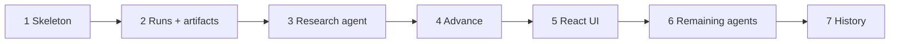

# SDLC Workbench — Product & Implementation Brief

## Table of contents

1. [Purpose](#1-purpose)
2. [Product goal](#2-product-goal)
3. [V1 workflow](#3-v1-workflow)
4. [Stages and artifacts](#4-stages-and-artifacts)
5. [Core product rule](#5-core-product-rule)
6. [Domain model](#6-domain-model)
7. [Stage configuration](#7-stage-configuration)
8. [Agent design](#8-agent-design)
9. [Subagents](#9-subagents)
10. [Context sent to an agent](#10-context-sent-to-an-agent)
11. [Tech stack](#11-tech-stack)
12. [Repository and backend structure](#12-repository-and-backend-structure)
13. [V1 API](#13-v1-api)
14. [Main UI](#14-main-ui)
15. [Approval rule](#15-approval-rule)
16. [Errors](#16-errors)
17. [V1 non-goals](#17-v1-non-goals)
18. [First vertical slice](#18-first-vertical-slice)
19. [Implementation order](#19-implementation-order)
20. [Testing strategy](#20-testing-strategy)
21. [Agentic IDE implementation instructions](#21-agentic-ide-implementation-instructions)
22. [Definition of V1 done](#22-definition-of-v1-done)
23. [After V1](#23-after-v1)

---

## 1. Purpose

Build a small web application where a software work item moves through a fixed SDLC workflow.

Each stage uses one specialized AI agent.

Each agent consumes approved artifacts from earlier stages and produces one or more new artifacts.

A human reviews the output before the work item moves to the next stage.

The application owns orchestration. Do not use an LLM orchestrator in V1.

---

## 2. Product goal

A user can:

1. Create a project.
2. Create a work item.
3. Run the current SDLC stage.
4. Review the generated artifacts.
5. Run the stage again if needed.
6. Approve the result.
7. Move the work item to the next stage.
8. Continue until verification is complete.
9. Review the full artifact and run history.

---

## 3. V1 workflow

```text
Research
→ Definition
→ Design
→ Implementation
→ Verification
→ Done
```

The workflow is fixed in V1.

Do not build a workflow editor.

---

## 4. Stages and artifacts

### Research

Inputs:

- Work item title
- Work item description

Agent:

- `ResearchAgent`

Required output:

- `RESEARCH_BRIEF`

Purpose:

Collect and synthesize information that is relevant to the work item.

Do not produce a product specification or technical design here.

---

### Definition

Inputs:

- Work item
- `RESEARCH_BRIEF`

Agent:

- `DefinitionAgent`

Required outputs:

- `PRD`
- `ACCEPTANCE_CRITERIA`

Purpose:

Define what must be built and what success means.

---

### Design

Inputs:

- Work item
- `RESEARCH_BRIEF`
- `PRD`
- `ACCEPTANCE_CRITERIA`

Agent:

- `DesignAgent`

Required output:

- `TECH_DESIGN`

Optional outputs:

- `ADR`
- `UX_SPEC`
- `WIREFRAME`

Purpose:

Define how the work should be implemented.

Create optional artifacts only when the work needs them.

Examples:

- A backend-only change does not need a wireframe.
- A significant architectural decision can produce an ADR.
- A user-facing flow can produce a UX specification.

---

### Implementation

Inputs:

- `PRD`
- `ACCEPTANCE_CRITERIA`
- `TECH_DESIGN`
- Relevant optional design artifacts

Agent:

- `ImplementationAgent`

Required output:

- `IMPLEMENTATION`

Purpose:

Implement the approved design.

In the first usable version, `IMPLEMENTATION` can be text or a code patch representation.

Direct repository editing is not required for the first milestone.

---

### Verification

Inputs:

- `PRD`
- `ACCEPTANCE_CRITERIA`
- `TECH_DESIGN`
- `IMPLEMENTATION`

Agent:

- `VerificationAgent`

Required outputs:

- `TEST_CASES`
- `VERIFICATION_REPORT`

Purpose:

Check the implementation against the approved requirements and design.

The verification agent must be separate from the implementation agent.

---

## 5. Core product rule

```text
application orchestrates
agents perform specialized work
artifacts connect stages
human approves transitions
```

Do not create a general-purpose orchestrator agent in V1.

The application already knows:

- the current stage;
- which agent to run;
- which artifacts are required;
- which stage comes next.

---

## 6. Domain model

Keep the domain small.

All `id` fields are UUIDs.

### Project

```text
id
name
created_at
```

### WorkItem

```text
id
project_id
title
description
current_stage
status
created_at
updated_at
```

Suggested statuses:

```text
ACTIVE
DONE
```

Do not add more statuses until a real use case requires them.

### Artifact

```text
id
work_item_id
stage_run_id
kind
content
created_at
```

Artifact kinds:

```text
RESEARCH_BRIEF
PRD
ACCEPTANCE_CRITERIA
TECH_DESIGN
ADR
UX_SPEC
WIREFRAME
IMPLEMENTATION
TEST_CASES
VERIFICATION_REPORT
```

Use one `Artifact` model with a `kind`.

Do not create one class or table per artifact type.

### StageRun

```text
id
work_item_id
stage
model
status
error
input_tokens
output_tokens
cost_usd
created_at
completed_at
```

`error` is empty unless the run failed.

`input_tokens`, `output_tokens` and `cost_usd` are empty when the provider returned no usage, for example when the call failed before a response. `cost_usd` is computed once, when the run completes, from the price table in `config/`. Do not compute it again later, because prices change.

Suggested statuses:

```text
RUNNING
COMPLETED
FAILED
```

A stage run can produce multiple artifacts.

---

## 7. Stage configuration

The workflow is fixed, but stage behavior should be configured in code.

Example:

```python
StageDefinition(
    stage=Stage.DESIGN,
    agent="design",
    required_inputs=[
        ArtifactKind.PRD,
        ArtifactKind.ACCEPTANCE_CRITERIA,
    ],
    possible_outputs=[
        ArtifactKind.TECH_DESIGN,
        ArtifactKind.ADR,
        ArtifactKind.UX_SPEC,
        ArtifactKind.WIREFRAME,
    ],
)
```

Do not persist stage definitions in the database in V1.

---

## 8. Agent design

Use one agent per stage.

```text
ResearchAgent
DefinitionAgent
DesignAgent
ImplementationAgent
VerificationAgent
```

Each agent has:

```text
instructions
model
expected output contract
```

Agents do not:

- decide which agent runs next;
- move work items between stages;
- approve their own output.

---

## 9. Subagents

Do not implement generic subagents in V1.

Possible future examples:

```text
DesignAgent
├── Architecture specialist
└── UX specialist

VerificationAgent
├── Requirements reviewer
├── Test reviewer
└── Security reviewer
```

Add these only when a stage becomes too broad and the problem is observed in real use.

---

## 10. Context sent to an agent

Keep context explicit and deterministic.

For a stage run, build the prompt from:

```text
stage instructions
+
work item title
+
work item description
+
required approved artifacts from previous stages
```

Example:

```text
STAGE INSTRUCTIONS

Create a technical design.
Keep the solution simple.
Do not add components that are not required.

WORK ITEM

Title:
Add model routing

Description:
Route prompts based on semantic requirements.

INPUT ARTIFACTS

PRD:
...

ACCEPTANCE CRITERIA:
...
```

Do not add RAG, embeddings, vector databases, or agent memory in V1.

---

## 11. Tech stack

### Backend

```text
Python 3.12
FastAPI
Uvicorn
asyncio
Pydantic
Pydantic Settings
SQLAlchemy 2 AsyncSession
asyncpg
Alembic
PostgreSQL
```

### Async persistence

Use this database stack in V1:

```text
FastAPI
→ SQLAlchemy 2 AsyncSession
→ asyncpg
→ PostgreSQL
```

Use Alembic for database schema migrations.

Use `async def` for application paths that perform async I/O.

Do not install `asyncio`. It is part of Python.

Do not use synchronous SQLAlchemy sessions in the main request flow in V1.

### Python tooling

```text
uv        → Python, virtual environment, dependencies, lockfile
Ruff      → linting, formatting, import sorting
Pyright   → static type checking
pytest    → tests
```

Use `backend/pyproject.toml` as the Python project configuration and dependency manifest.

Use `backend/uv.lock` for reproducible dependency resolution.

Run Python commands from `backend/`:

```bash
cd backend

uv add <package>
uv add --dev <package>
uv run <command>
```

Do not add Poetry, pip-tools, Black, Flake8, isort, or mypy unless a real requirement appears.

### Frontend

```text
React
TypeScript
Vite
```

Use a SPA.

SSR is not required.

Add TanStack Query only when server-state handling becomes repetitive.

Do not add a global client-state library in V1.

### AI

Start with one provider implementation behind a provider-independent interface.

The domain and application layers must not import provider SDKs directly.

Provider calls are async.

Example:

```python
@dataclass(frozen=True)
class ModelResult:
    text: str
    input_tokens: int
    output_tokens: int


class ModelRunner(Protocol):
    async def run(
        self,
        *,
        model: str,
        prompt: str,
    ) -> ModelResult:
        ...
```

The runner returns token usage with the text. The application computes the cost. Providers do not know prices.

The first version can use one real provider.

The design must allow more providers later without changing domain rules.

---

## 12. Repository and backend structure

Use a simple monorepo with one backend application and one frontend application.

```text
python-agentic-sdlc/
├── backend/
│   ├── src/
│   │   └── agentic_sdlc/
│   │       ├── main.py
│   │       ├── api/
│   │       │   └── routes/
│   │       ├── application/
│   │       │   ├── projects.py
│   │       │   ├── work_items.py
│   │       │   ├── run_stage.py
│   │       │   └── advance_work_item.py
│   │       ├── domain/
│   │       │   └── enums.py
│   │       ├── infrastructure/
│   │       │   ├── database/
│   │       │   │   ├── session.py
│   │       │   │   └── models.py
│   │       │   └── ai/
│   │       └── config/
│   ├── migrations/
│   ├── tests/
│   ├── alembic.ini
│   ├── pyproject.toml
│   └── uv.lock
├── frontend/
│   ├── src/
│   ├── package.json
│   ├── vite.config.ts
│   └── tsconfig.json
├── compose.yaml
├── README.md
└── .gitignore
```

The repository root is the workspace. It is not a Python or frontend application.

Keep Python project files inside `backend/`.

Keep frontend project files inside `frontend/`.

Do not add Nx, Turborepo, Lerna, or another monorepo tool in V1.

Responsibilities:

```text
api
→ HTTP validation and response mapping

application
→ use-case orchestration

domain
→ business rules and domain objects

infrastructure
→ database and external AI providers

config
→ runtime configuration and fixed stage definitions
```

SQLAlchemy mapped classes in `infrastructure/database/models.py` are the only entity classes. Do not add parallel domain dataclasses. `domain/` holds enums and stage-transition rules.

Do not add repositories, command buses, event buses, or dependency-injection frameworks unless they become necessary.

---

## 13. V1 API

Start with these endpoints:

```text
POST   /projects
GET    /projects
GET    /projects/{project_id}

POST   /projects/{project_id}/work-items
GET    /projects/{project_id}/work-items

GET    /work-items/{work_item_id}

POST   /work-items/{work_item_id}/run
POST   /work-items/{work_item_id}/advance
```

Request and response shapes:

| Endpoint | Request body | Success | Response body |
| --- | --- | --- | --- |
| `POST /projects` | `{ "name": str }` | 201 | `Project` |
| `GET /projects` | — | 200 | `Project[]`, newest first |
| `GET /projects/{project_id}` | — | 200 | `Project` |
| `POST /projects/{project_id}/work-items` | `{ "title": str, "description": str }` | 201 | `WorkItem` |
| `GET /projects/{project_id}/work-items` | — | 200 | `WorkItem[]`, newest first |
| `GET /work-items/{work_item_id}` | — | 200 | `WorkItem` |
| `POST /work-items/{work_item_id}/run` | — | 201 | `StageRun` with its `artifacts` |
| `POST /work-items/{work_item_id}/advance` | — | 200 | `WorkItem` |

```text
Project   = { id, name, created_at }
WorkItem  = { id, project_id, title, description, current_stage, status, created_at, updated_at }
StageRun  = { id, work_item_id, stage, model, status, error, input_tokens, output_tokens, cost_usd, created_at, completed_at, artifacts: Artifact[] }
Artifact  = { id, work_item_id, stage_run_id, kind, content, created_at }
```

Optional after the first vertical slice:

```text
GET    /work-items/{work_item_id}/runs
GET    /work-items/{work_item_id}/artifacts
```

Do not create update or delete endpoints until the UI needs them.

---

## 14. Main UI

### Project board

Show one column per stage:

```text
Research | Definition | Design | Implementation | Verification | Done
```

Show each work item in its current stage.

V1 does not need drag and drop.

Click a work item to open its detail view.

### Work item detail

Show:

```text
title
description
current stage
configured model
stage instructions
required input artifacts
latest stage output
previous runs
```

Actions:

```text
Run stage
Run again
Approve and continue
```

Do not implement inline workflow editing in V1.

---

## 15. Approval rule

A work item cannot advance until the current stage has at least one successful run.

The human explicitly selects:

```text
Approve and continue
```

Then the application moves the work item to the next stage.

No automatic stage transitions in V1.

The approved artifacts of a stage are the artifacts of its latest `COMPLETED` run at the moment of advance. A stage cannot run after the work item leaves it, so this set does not change later.

| Current stage | Action | Precondition | Result |
| --- | --- | --- | --- |
| any except `DONE` | run | required inputs approved | new `StageRun` |
| any except `DONE` | advance | current stage has at least one `COMPLETED` run | next stage |
| `VERIFICATION` | advance | same as above | stage `DONE`, status `DONE` |
| `DONE` | run or advance | — | error: stage already complete |

---

## 16. Errors

Handle these cases explicitly:

```text
work item not found
project not found
required input artifact missing
stage already complete
agent or provider failure
invalid stage transition
```

Do not create a complex error hierarchy at the start.

Use a small set of domain or application exceptions and map them to HTTP responses.

| Case | HTTP |
| --- | --- |
| project or work item not found | 404 |
| required input artifact missing | 409 |
| stage already complete (work item is `DONE`) | 409 |
| invalid stage transition | 409 |
| agent or provider failure | 201 with run `status = FAILED` and `error` set |

`POST /run` is synchronous in V1. A process crash during the provider call leaves the run in `RUNNING`. This is a known V1 limit.

---

## 17. V1 non-goals

Do not implement:

```text
LLM orchestrator
generic subagent system
multi-agent conversation
RAG
vector database
MCP
GitHub integration
automatic repository editing
background queue
WebSockets
real-time collaboration
drag and drop
custom workflow builder
complex permissions
teams or organizations
billing
cost optimization (V1 tracks cost; it does not optimize it)
model router
automatic stage transitions
```

These are future options, not V1 requirements.

---

## 18. First vertical slice

Do not build all stages at once.

Implement this first:

```text
create project
→ create work item
→ work item starts in Research
→ run ResearchAgent
→ save StageRun
→ save RESEARCH_BRIEF artifact
→ show result in UI
→ approve
→ move work item to Definition
```

When this works end to end, generalize the same mechanism to the remaining stages.

This is the first definition of success.

---

## 19. Implementation order

Work one iteration at a time. An iteration is complete only when all of its acceptance boxes are checked and the verification commands in §20 pass.

Tasks are numbered `<iteration>.<n>` and acceptance criteria `AC<iteration>.<n>`. Check a task box only after the owner reviews and accepts the code. Check an acceptance box only after you see it pass.

| # | Iteration | Delivers | Status |
| --- | --- | --- | --- |
| 1 | Backend skeleton | projects API, then work items API | done |
| 2 | Artifacts and stage runs | `StageRun` and `Artifact` persistence | not started |
| 3 | Research agent | `POST /run` for Research | not started |
| 4 | Approval and transition | `POST /advance` for Research → Definition | not started |
| 5 | Minimal React UI | Research slice in the browser | not started |
| 6 | Remaining agents | all stages through `DONE` | not started |
| 7 | History and polish | run and artifact history | not started |



Iterations 1–5 are the first vertical slice (§18).

### Iteration 1 — Backend skeleton

Build projects end to end first. Then repeat the same pattern for work items.

Setup tasks:

- [x] 1.1 FastAPI app with `/health`
- [x] 1.2 Settings from `DATABASE_URL` in `config/settings.py`

Project tasks:

- [x] 1.3 Add `sqlalchemy[asyncio]`; async engine, session and `get_session` dependency
- [x] 1.4 `Base` and `Project` ORM model with UUID key
- [x] 1.5 Alembic async init and migration `0001`: `projects`
- [x] 1.6 Use cases: create, list and get project
- [x] 1.7 `ProjectCreate` and `ProjectOut` schemas; routes `POST /projects`, `GET /projects`, `GET /projects/{id}`
- [x] 1.8 `NotFoundError` mapped to 404
- [x] 1.9 Add dev `pytest-asyncio`; test database, client fixture and project API tests

Work item tasks:

- [x] 1.10 `Stage` and `WorkItemStatus` enums
- [x] 1.11 `WorkItem` ORM model and migration `0002`: `work_items`
- [x] 1.12 Use cases: create, list and get work item
- [x] 1.13 `WorkItemCreate` and `WorkItemOut` schemas; routes `POST /projects/{id}/work-items`, `GET /projects/{id}/work-items`, `GET /work-items/{id}`
- [x] 1.14 Work item API tests

Setup acceptance:

- [x] AC1.1 API starts and `/health` returns 200.
- [x] AC1.2 Settings load `DATABASE_URL` from `.env`.

Project acceptance (after 1.9):

- [x] AC1.3 `alembic upgrade head` creates `projects` on the compose Postgres.
- [x] AC1.4 A project can be created, listed and read.
- [x] AC1.5 An empty project name returns 422.
- [x] AC1.6 An unknown project returns 404.

Work item acceptance (after 1.14):

- [x] AC1.7 `alembic upgrade head` creates `work_items`.
- [x] AC1.8 A work item can be created, listed and read.
- [x] AC1.9 A new work item starts in `RESEARCH` with status `ACTIVE`.
- [x] AC1.10 An unknown work item, or a work item in an unknown project, returns 404.

### Iteration 2 — Artifacts and stage runs

Tasks:

- [ ] 2.1 `ArtifactKind` and `StageRunStatus` enums
- [ ] 2.2 `StageRun` model with `error` field
- [ ] 2.3 `Artifact` model linked to work item and run
- [ ] 2.4 Migration `0003`
- [ ] 2.5 Persistence tests

Acceptance:

- [ ] AC2.1 A stage run can be stored.
- [ ] AC2.2 A run can have multiple artifacts.
- [ ] AC2.3 Artifacts are linked to the correct work item and run.

### Iteration 3 — Research agent vertical slice

Tasks:

- [ ] 3.1 `ModelRunner` protocol
- [ ] 3.2 Fake `ModelRunner` for tests
- [ ] 3.3 One real provider implementation and its API key setting
- [ ] 3.4 `StageDefinition` for `RESEARCH` in `config/`
- [ ] 3.5 `ResearchAgent` instructions and prompt builder (§10)
- [ ] 3.6 `run_stage` use case for `RESEARCH`
- [ ] 3.7 `POST /work-items/{id}/run` returns the run with its artifacts
- [ ] 3.8 Provider smoke test, excluded from the normal suite
- [ ] 3.9 `ModelResult` with token usage, returned by every `ModelRunner`
- [ ] 3.10 Price table for each model in `config/`
- [ ] 3.11 `StageRun` fields `input_tokens`, `output_tokens`, `cost_usd` and their migration

Acceptance:

- [ ] AC3.1 `POST /work-items/{id}/run` runs the Research stage.
- [ ] AC3.2 A successful run stores a `RESEARCH_BRIEF`.
- [ ] AC3.3 A failed provider call marks the run `FAILED` and sets `error`.
- [ ] AC3.4 No other stage is implemented yet.
- [ ] AC3.5 A completed run stores its token usage and cost.

### Iteration 4 — Approval and transition

Tasks:

- [ ] 4.1 Stage order and next-stage rule in `domain/`
- [ ] 4.2 `advance_work_item` use case
- [ ] 4.3 `POST /work-items/{id}/advance`
- [ ] 4.4 409 mapping for invalid transitions
- [ ] 4.5 Domain tests for valid and invalid transitions

Acceptance:

- [ ] AC4.1 A work item cannot advance without a completed Research run.
- [ ] AC4.2 Approving moves it to `DEFINITION`.

### Iteration 5 — Minimal React UI

Tasks:

- [ ] 5.1 Vite + React + TypeScript app in `frontend/`
- [ ] 5.2 CORS for the Vite dev origin
- [ ] 5.3 Project list and create project
- [ ] 5.4 Stage board for one project
- [ ] 5.5 Create work item
- [ ] 5.6 Work item detail with latest run output
- [ ] 5.7 Run stage and Approve and continue actions

Acceptance:

- [ ] AC5.1 The full Research vertical slice works from the browser.

### Iteration 6 — Remaining agents

Tasks:

- [ ] 6.1 Output contract for runs that produce more than one artifact
- [ ] 6.2 Generalize `run_stage` to read `StageDefinition` for every stage
- [ ] 6.3 Required-input check with 409 when an approved input is missing
- [ ] 6.4 `DefinitionAgent`
- [ ] 6.5 `DesignAgent` with optional outputs
- [ ] 6.6 `ImplementationAgent`
- [ ] 6.7 `VerificationAgent`
- [ ] 6.8 Verification → `DONE` sets status `DONE`
- [ ] 6.9 409 for run or advance on a `DONE` work item

Acceptance:

- [ ] AC6.1 Every stage runs through the same stage-run mechanism.
- [ ] AC6.2 Each stage receives only the approved artifacts it requires.
- [ ] AC6.3 A work item can move from `RESEARCH` to `DONE`.

### Iteration 7 — History and polish

Tasks:

- [ ] 7.1 `GET /work-items/{id}/runs`
- [ ] 7.2 `GET /work-items/{id}/artifacts`
- [ ] 7.3 Previous runs in the work item detail
- [ ] 7.4 Artifact history
- [ ] 7.5 Loading states
- [ ] 7.6 Error states
- [ ] 7.7 Token and cost totals for each work item and each project in the API
- [ ] 7.8 Usage and cost of each run, and totals, in the work item detail and the project view

Acceptance:

- [ ] AC7.1 The user can inspect previous stage runs and generated artifacts.
- [ ] AC7.2 No large UI redesign.
- [ ] AC7.3 The user can see the tokens and cost of each run, work item and project.

---

## 20. Testing strategy

### Domain tests

Test:

```text
valid stage transitions
invalid stage transitions
required-artifact rules
```

### Application tests

Test use cases with fake infrastructure:

```text
run stage
save artifacts
provider failure
advance work item
```

### API tests

Use `httpx.AsyncClient` with `ASGITransport` and `pytest-asyncio`. Run them against a separate `agentic_sdlc_test` database on the compose Postgres.

Mock application use cases when the test is only about HTTP behavior.

### Provider integration test

Keep one explicit integration or smoke test for the real AI provider.

Do not make the normal test suite depend on an external API.

### Verification commands

Run from `backend/` before completing an iteration:

```bash
cd backend

uv run pytest
uv run ruff check .
uv run ruff format --check .
uv run pyright
```

---

## 21. Agentic IDE implementation instructions

When implementing this specification:

1. Work one iteration at a time.
2. Do not implement future iterations early.
3. Before coding, state the files that will change.
4. Keep each use case small.
5. Prefer plain Python over framework abstractions.
6. Add tests with the behavior that each iteration introduces.
7. Run tests, Ruff, and Pyright before marking an iteration complete.
8. Keep Python code and Python tooling inside `backend/`.
9. Keep React code and frontend tooling inside `frontend/`.
10. Run `uv add`, `uv add --dev`, and `uv run` from `backend/`.
11. Do not add dependencies unless the current iteration requires them.
12. Do not introduce a generic abstraction for one implementation.
13. Do not add monorepo tooling unless a real requirement appears.
14. Stop after the iteration acceptance criteria pass.
15. Update the checkboxes and the status table in §19 in the same change as the code.

Use KISS and YAGNI.

Use short names and direct code.

Prefer explicit behavior over clever abstractions.

Do not replace the selected toolchain with alternatives without a concrete reason.

---

## 22. Definition of V1 done

V1 is complete when a user can:

```text
create a project
→ create a work item
→ run Research
→ review and approve RESEARCH_BRIEF
→ run Definition
→ review and approve PRD + ACCEPTANCE_CRITERIA
→ run Design
→ review TECH_DESIGN and optional artifacts
→ run Implementation
→ review IMPLEMENTATION
→ run Verification
→ review TEST_CASES + VERIFICATION_REPORT
→ mark work item Done
```

The user can also inspect previous stage runs, generated artifacts, and token usage and cost.

Nothing else is required for V1.

---

## 23. After V1

These items are not part of V1. Do not start them before §22 is complete.

| # | Item | Depends on |
| --- | --- | --- |
| 8 | Usage dashboards | usage fields on `StageRun` (iteration 3) |
| 9 | Edit agent instructions in the UI | none |

### 8 — Usage dashboards

Tasks:

- [ ] 8.1 Charts of tokens and cost by stage, model, work item and time
- [ ] 8.2 Latency of each run (`completed_at - created_at`)
- [ ] 8.3 Other run metadata that becomes relevant, such as model effort settings

### 9 — Edit agent instructions in the UI

Tasks:

- [ ] 9.1 Move agent instructions from code to `.md` files that the backend reads
- [ ] 9.2 Endpoints to read and write the instructions of a stage
- [ ] 9.3 Store a snapshot or hash of the rendered prompt on each `StageRun`, so old outputs stay explainable
- [ ] 9.4 Editor in the work item or stage view
- [ ] 9.5 Decide what happens when instructions change while a run is in progress

Acceptance:

- [ ] AC9.1 A user can change the instructions of a stage without a code change.
- [ ] AC9.2 Each run shows which instructions produced it.
